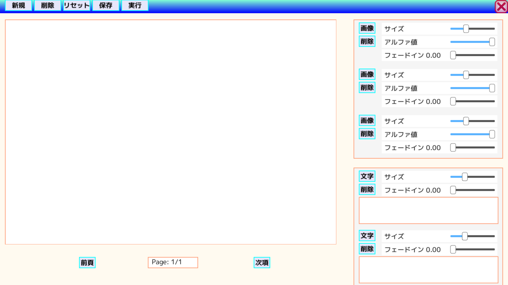

#

・絵本エディタおよび絵本

1. 概要

    OpenSiv3Dを使用し，フリー画像から絵本(というか紙芝居)を作成できるエディタを作成した．Window10で動作する．

    

2. 絵本エディタの使用方法

    * 2.1 画像の設定

        * "画像"ボタンを押して，表れたエクスプローラーで画像ファイルを選択できる．
        * "削除"ボタンを押すと，画像を消すことができる．
        * スライダーを動かすことで，画像のサイズや不透明度，描画タイミングを調整できる．
        * 画面中央の画面に表示されるので，右クリックで位置を調整できる．

    * 2.2 文字の設定

        * 白い矩形をクリックすると，枠が水色になる．このとき，キーボード入力を受ける(全角入力は，Enterキーを押すまで，表示できないバグあり).
        * 入力後に"文字"ボタンを押すだけで設定できる．
        * "削除"ボタンを押すと，文字を消すことができる．
        * スライダーを動かすことで，文字のサイズや描画タイミングを調整できる．
        * 画面中央の画面に表示されるので，文字の左上に表示される矩形を左クリックすることで，位置を調整できる．

    * 2.3 画面中央の編集画面について

        * マウスホイールで拡大・縮小
        * 右クリックでスクロール

    * 2.4 ページの作成等について

        * 画面上部の"新規", "削除"ボタンによってページを作成，削除を行うことができる．
        * "実行"ボタンを押すと，絵本を再生できる．
        * "保存"ボタンを押すと，編集情報をJSONファイルに書き込む．
        * "リセット"ボタンを押すと，現在の編集情報をなかったことにできる．
        * "前項", "次項"ボタンを押すと，編集するページを変更できる．このとき，編集情報は一時ファイルに書き込まれる．

3. 絵本再生時の操作について

    * 左クリックで次ページへ，右クリックで前ページへ遷移する．

4. 注意点

    * visual studioから実行すると，クリックイベントなどが上手く動作しない事がある．変更を行った場合，PictureBook/AppあるいはPictureBookEditor/Appディレクトリ下の.exeファイルを実行する必要がある．
